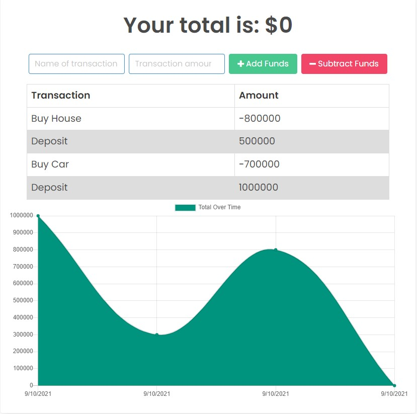

# Budget Tracker

        

## Description 

---

A budget tracker used to track withdrawals and deposits with or without a data/internet connection

## Table of Contents

---

  - [Installation](#installation)
  - [Usage](#usage)
  - [Links](#links)
  - [Screenshot](#screenshot)
  - [License](#license)
  - [Contributing](#contributing)
  - [Questions](#questions)
  

## Installation 

---

1. Clone the repository
2. run ```npm install```

## Usage

---

1. Setup mongoDB
2. run ```npm start```

## Links

---

## Screenshot



---

## License

This project is licensed under the [MIT License](https://choosealicense.com/licenses/mit).

---

## Contributing

Contributions, issues and feature requests are welcome.

---

## Questions

Here is my [GitHub](https://github.com/chunngaimo)
and Feel free to ask any questions and contact me at wjy16888888@gmail.com.
